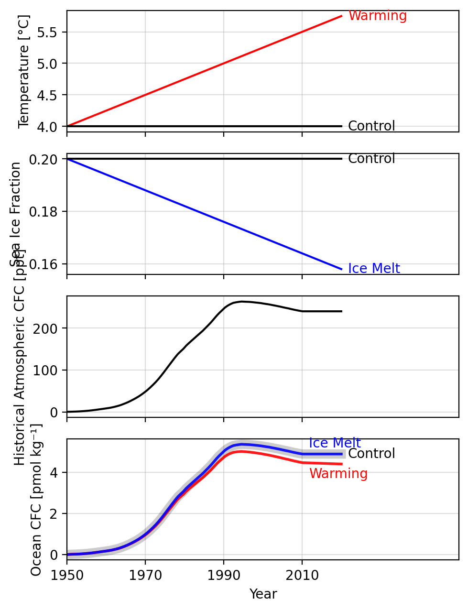

# CFCFluxes

This code calculates air-sea fluxes of CFC-11 and CFC-12 according to 
OMIP protocols (Orr et al., 2017) and Dutay (2002). Using this code, one can calculate realistic fluxes 
as well as test the effects of different parameters on surface fluxes. 

For example, one can make the following visualization using GCM output to test how different 
aspects of climate change influences surface CFC-11 Concentrations: 

You can even do idealized experiments! 

## The main equations

### Gas Exchange Flux
The CFC flux ($F$) is given by:

$F_{CFC} = k_w (CFC_{sat} - CFC_{ocn})$

where:
- $k_w$ is the air-sea gas transfer velocity (m/s)
- $CFC_{sat}$ is the saturation concentration in equilibrium with the water-vapor-saturated atmosphere (mol/m^3)
- $CFC_{ocn}$ is the sea surface tracer concentration (mol/m^3)

### The Piston Velocity (Gas Transfer Coefficient)

The instantaneous gas transfer coefficient ($k_w$) follows Wanninkhof (1992):

$k_w = a \left(\frac{Sc}{660}\right)^{-1/2} u^2 (1 - f)$

where:
- $a = 0.251$ $\frac{cm/hr}{(m/s)^2}$ (equivalent to $6.97 \times 10^{-7} \frac{s}{m}$)
- $Sc = A + BT_c + CT_c^2 + DT_c^3 + ET_c^4$ (dimensionless Schmidt number) where $T_c$ is surface temperature (°C)
- $u$ is 10-meter wind speed (m/s)
- $f$ is sea ice coverage fraction

### Saturation Concentration

For small variations in surface pressure, $CFC_{sat}$ can be approximated as:

$CFC_{sat} \approx \frac{P_a}{P^0_{CFC}} F x_{CFC}$

where:
- $F$ is the CFC solubility function with units mol/m^3/atm (Warner and Weiss, 1985)
- $x_{CFC}$ is atmospheric partial pressure (equivalent to $10^{-12} \times ppt$)
- $P_a$ is sea surface pressure in atm
- $P^0_{CFC} = 1 \text{ atm}$ (reference pressure)

## References

- Dutay et al. (2002)
- Wanninkhof (1992)
- Warner and Weiss (1985)
- Orr et al. (2017)
